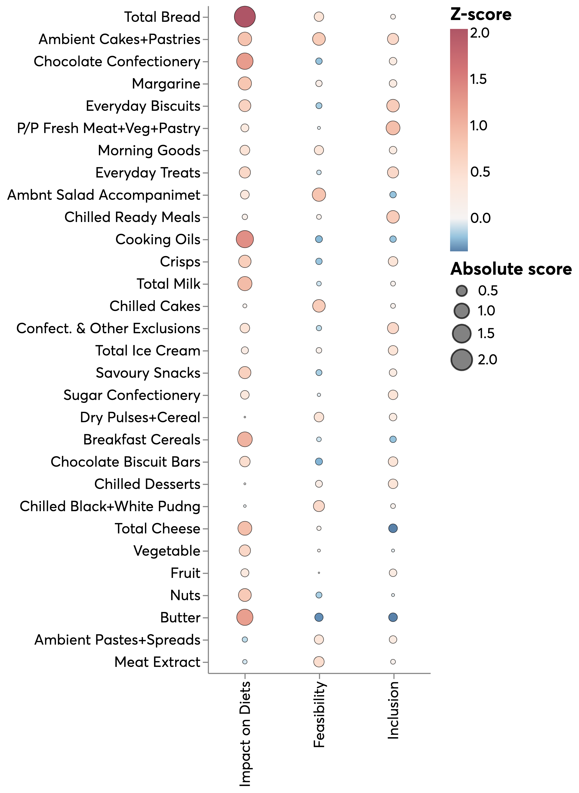

<!-- #region -->

# Identifying targets for reformulation

**_Repository for hosting the analysis that contributes to the report [insert link]_**

## Welcome :wave:

This repository contains the code and documentation for a project that uses data on food and drink purchases to identify targets for reformulation. To see the results and findings from this analysis, take a look at the report [insert link here].

## Background

As part of a wider project on reformulation, the Data Science team working on Nesta’s healthy life mission has been analysing a dataset provided by an international market research company, commissioned by Nesta. This dataset contains food and drink purchases from a sample of households in Great Britain. For every purchase there is information about the product, such as: the food and drink category it belongs to, the volume purchased and its nutritional content.

Using this dataset we have created a series of metrics that can help us identify a list of food and drink categories that could be potential targets for reformulation.

### What is reformulation?

Reformulation is the process of changing the ingredients of a product, usually while trying to maintain taste and flavour.

This can be done in many ways but in our case we are looking at the reduction of calories to make the product healthier.

## Analysis in four steps

#### Step 1: Build a set of metrics for reformulation suitability

We identified and built a set of metrics to rank food categories that took into account what we identified as the most important factors in deciding whether a product should be reformulated. This led us to three criteria:

1. <b>Impact on diets</b>: the extent to which reformulating products in a category will reduce the volume of calories consumed in the population.
2. <b>Feasibility of reformulation</b>: whether reformulating a product is commercially and technically feasible. To assess this we looked at the variability of levels of calorie density across products within the same category. More variability indicates that it is possible to have lower calorie dense products within a category, and therefore, that commercial and technical barriers to reformulation might be lower.
3. <b>Inclusion</b>: whether reformulating certain products would benefit more groups across society and especially those who are most disadvantaged.

We combined our indicators into a single metric of reformulation suitability by averaging scores within each of the criteria and then taking a weighted average at food category level. The figure below shows how each category has scored across the three domains outlined above.
<br>
<br>



<br clear="left"/>

#### Step 2: Identify food categories that are targets for reformulation

After identifing the food categories that scored most highly across the three criteria, we ranked food categories based on their degree of potential for reformulation and their contribution to calories within shopping baskets. From this ranking we selected the top 10 categories that were most suitable for reformulation.

The figure below shows food categories sorted from high to low on the score for reformulation suitability, alongside the cumulative sum of calorie contribution to average shopping baskets.
<br>
<br>


<br clear="left"/>

#### Step 3: Understanding the targets for reformulation

We then looked at the final categories in a bit more detail including:

1. Identifying more detailed categories within each category that are strong targets, based on the same crieria we used to select the broader categories.
2. Producing a series of visualisations to better describe the categories such as the sales weighted energy density per 100g.
3. Looked at the macro nutrient proportions in each broader and more granular category.

<br>
<br>


<br clear="left"/>

#### Step 4: Impact of reformulation on daily calorie intake

We calculated the potential population impact of reformulating the chosen categories on daily calorie consumption per person. To estimate, we assumed that all discretionary product categories could be reformulated to lose between 5% and 10% of their calories as suggested in previous Public Health England Calorie Reduction Programme analysis. We assumed that no reformulation would be possible for staples such as bread, margarine, milk and cooking oils.

<br>
<br>


<br clear="left"/>

## Setup

- Meet the data science cookiecutter [requirements](http://nestauk.github.io/ds-cookiecutter/quickstart), in brief:
  - Install: `git-crypt`, `direnv`, and `conda`
  - Have a Nesta AWS account configured with `awscli`
- Run `make install` to configure the development environment:
  - Setup the conda environment
  - Configure pre-commit
  - Configure metaflow to use AWS

## Installation and running the code

### Clone and set up the repo

1. Follow the below steps to setup the project.

```shell
$ git clone https://github.com/nestauk/ahl_food_reformulation
$ cd ahl_food_reformulation
```

2. Run the command `make install` to create the virtual environment and install dependencies

### Download and save the data

#### Internal users

Download the data from the `latest_data` folder in `ahl-private-data` s3 bucket and save to following folders:

- `inputs/data`
- `outputs/data`

The data in `latest_data` should be inside `inputs` and `outputs` folders.

### Run the code

The scripts needed to run the code and reproduce the analysis are all the pipeline folder.

1. `cd ahl_food_reformulation/pipeline`
2. Navigate to the sub-folders listed in the readme and run the scripts in the order listed
<!-- #endregion -->
